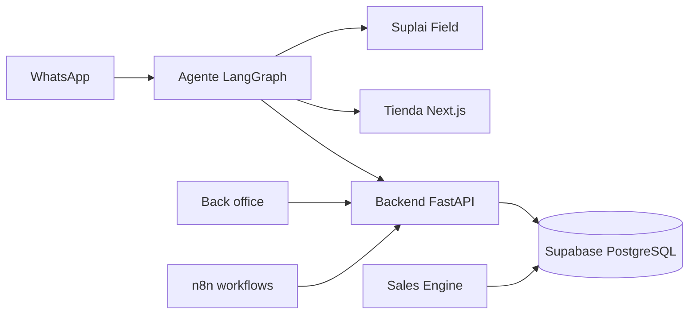

<div align="center">


# 👋 Hola, soy Facundo Lorenzo 🇦🇷

### **Founder & Builder @ Suplai Sales · Backend & AI Engineer · Ex CTO**

*Peligrosamente optimista.*  
Hoy construyo el futuro de la venta B2B para distribuidoras — por WhatsApp, con IA y en producción.

[](https://suplaisales.com)
[](https://fk-software.com)
[](https://x.com/facundo_l77)

📍 Córdoba, Argentina

</div>

---

## 🚀 Hoy: 100% Suplai Sales

**[Suplai Sales](https://suplaisales.com)** es la plataforma de IA para **distribuidoras de consumo masivo** que quieren vender más, atender mejor y operar con menos fricción.


| Producto | Qué hace |
|----------|----------|
| 🤖 **Agente conversacional** | Toma pedidos, responde consultas y recomienda por WhatsApp |
| 🛒 **[Tienda B2B](https://tienda.suplaisales.com)** | Catálogo web con link directo desde el agente |
| 📱 **[Suplai Field](https://field.suplaisales.com)** | App mobile-first para vendedores: cartera, tareas y torneos |
| 🏢 **Back office** | Configura catálogo, promos, reglas y red comercial |
| 🧠 **Sales Engine** | ML de co-ocurrencia y frecuencia de compra por PdV |
| 📡 **Sniffer** | Análisis de conversaciones reales vendedor–cliente vía Kommo |

> *De un mensaje de WhatsApp a un pedido cerrado — sin llamadas, sin planillas, sin fricción.*

---

## 🏗️ Arquitectura que estoy construyendo



**Stack del producto:**
- **Agente:** Python · FastAPI · LangGraph · OpenAI
- **Backend:** FastAPI · asyncpg · arquitectura multi-tenant por schema
- **Frontends:** Next.js · React
- **Data:** PostgreSQL / Supabase · modelos ML con scikit-learn
- **Infra:** Railway · Vercel · Docker · n8n para integraciones ERP

---

## 🧠 Background que trae valor al producto

| Experiencia | Cómo se traduce en Suplai |
|-------------|---------------------------|
| 💼 **Ex CTO de Clickie** | Producto, equipo y velocidad de iteración |
| 🛒 **IA para mayoristas** | Entiendo el rubro: pedidos, listas, promos, rutas |
| 🔒 **SIEM · Docker · K8s** | Infra observable y deploys confiables |
| 🏭 **MES industrial** | Sistemas críticos que no pueden caerse |
| 📊 **Data · MetroGAS · YPF** | Análisis a escala en operaciones complejas |
| 📦 **ERP Java** | Integraciones profundas con sistemas legacy |

---

## 🛠️ Stack técnico

<details open>
<summary><b>Lenguajes</b></summary>

<br>


</details>

<details>
<summary><b>Backend & AI</b></summary>

<br>


</details>

<details>
<summary><b>Infra & Data</b></summary>

<br>


</details>

---

## 📈 GitHub en números

<div align="center">


<br><br>


</div>

---

## 💡 Cómo construyo producto

```diff
+ Problema real del distribuidor → MVP en producción → métricas → iteración
```

- 🎯 **WhatsApp primero** — donde ya está el cliente, ahí vendemos  
- 🏢 **Multi-tenant desde el día uno** — un producto, muchas distribuidoras  
- 📐 **Arquitectura clara** — repos separados, contratos explícitos, deploy independiente  
- 🔭 **Observable** — logs, healthchecks y E2E antes de cada release  
- 🚢 **Ship fast** — PRs chicos, Railway + Vercel, feedback real de operadores  

---

## 📬 Contacto

¿Sos distribuidora, integrador o inversor y querés ver Suplai en acción?

<div align="center">

[](https://suplaisales.com)
[](https://tienda.suplaisales.com)
[](https://github.com/Facu-hub-code)

</div>

---

<div align="center">

```diff
+ Construyendo el canal de ventas B2B que las distribuidoras merecen.
```

⭐️ *De Córdoba para el mundo — mate, código y pedidos por WhatsApp.*

</div>
